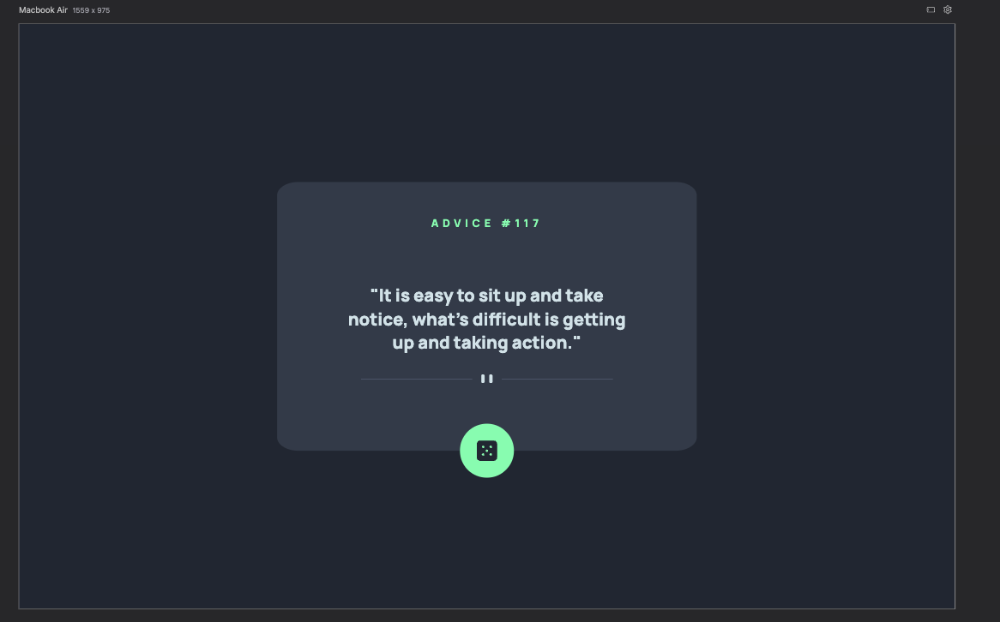
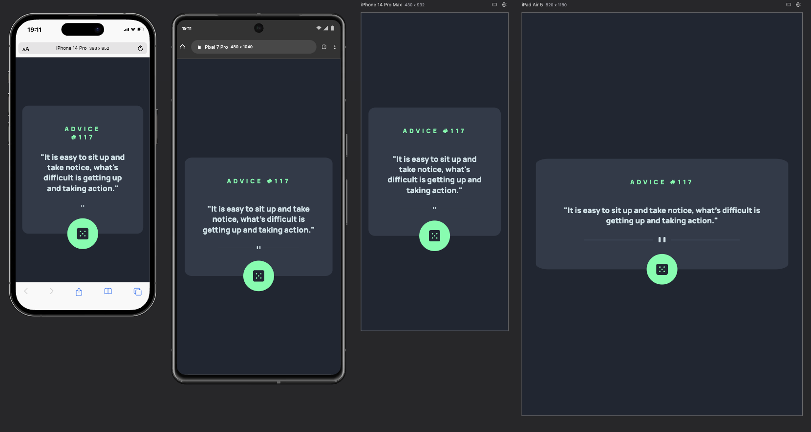

# 💡 Gerador de Conselhos

Este projeto é parte do exercício de HTML e CSS Avançado - Parte 1, com o objetivo de recriar o layout do desafio [Advice Generator App](https://www.frontendmentor.io/challenges/advice-generator-app-QdUG-13db). Nesta etapa, o foco é exclusivamente na construção do HTML e CSS, sem funcionalidades JavaScript.

---

## 📸 Como ficou

<p align="center">
  <strong>Versão Desktop:</strong><br/>
  
</p>

<p align="center">
  <strong>Versão Mobile:</strong><br/>
  
</p>

---

## 🧠 Objetivo

Reproduzir fielmente o layout proposto, com atenção a:
- Alinhamentos
- Tipografia
- Espaçamentos
- Responsividade (versão mobile e desktop)

---

## 🛠️ Tecnologias Utilizadas

- HTML5
- CSS3 (com Flexbox e Media Queries)
- Google Fonts

---

## 📁 Estrutura do Projeto

advice-generator-app-main/
├── index.html
├── src/
│ ├── css/
│ │ ├── reset.css
│ │ ├── style.css
│ │ └── variable.css
│ ├── images/
│ │ ├── screenshot-desktop.png
│ │ └── screenshot-mobile.png
└── README.md


---

## 📲 Como visualizar

1. Clone o repositório:
```bash
git clone https://github.com/seu-usuario/seu-repo.git

📚 Créditos

Desafio proposto por Dev em Dobro como parte do módulo de CSS Avançado.

